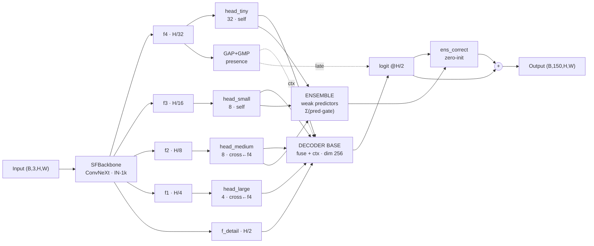

# SF-Seg V2 — Sparse-Focus Semantic Segmentation

Semantic segmentation with **top-k sparse attention** (4 sparse heads) +
**Sparse-Attention Ensemble Decoder (SAED)** — mỗi mask là một region-gated weak
predictor — và **class-presence-guided global context**. ConvNeXt-style backbone
**ImageNet-1k pretrained**. Dataset: ADE20K, **150-class protocol** (label 0 → ignore 255).

Chi tiết kiến trúc + lý do thiết kế: [docs/MODEL.md](docs/MODEL.md).

---

## Architecture — forward flow



Sơ đồ chi tiết SparseAttnHead + SAED ensemble: **[docs/MODEL.md](docs/MODEL.md)**.

---

## Model overview

```
Input (B, 3, H, W)
       │
       ▼  SFBackbone (ConvNeXt-micro, 2.55M)
       ├─ stem        → (B,  32, H/2,  W/2)   f_detail ─────────────────────────┐
       ├─ stage1      → (B,  32, H/4,  W/4)   f1 ──→ head_large  (SparseAttnHead) │
       ├─ stage2      → (B,  64, H/8,  W/8)   f2 ──→ head_medium (SparseAttnHead) │
       ├─ stage3      → (B, 128, H/16, W/16)  f3 ──→ head_small  (SparseAttnHead) │
       └─ stage4      → (B, 256, H/32, W/32)  f4 ──→ head_tiny   (SparseAttnHead) │
              │                                               │                    │
              │ GAP                            cross-attn ◄──┘ (head_medium)      │
              ▼                                                                    │
       g (B, 256) ──► presence_head → (B, 150) ──► BCE "class nào có trong ảnh"  │
              │                          │                                         │
              │ ctx_proj (mid-fusion)    │ late_ctx (late-fusion, 150×150)        │
              ▼                          ▼                                         │
   Decoder: fuse_ts → fuse_tsm → fuse_tsml(256 @H/4) ⊕ ctx → ConvNeXt refine      │
                                                              │                    │
                                       proj_hr 256→96, hr_fuse at H/2 ◄───────────┘
                                                              │
                                       Classifier 96→256→150  ⊕  late_ctx(p)
                                                              │
                              train: logits @ H/2  │  eval: bilinear ↑ full res
```

### Global context (presence-guided)

Lỗi phân loại chủ yếu là các cặp ngữ nghĩa cần scene context (door↔wall,
house↔building 46%, plant↔tree — đo bằng `scripts/analyze_errors.py`).
Ba cơ chế phối hợp:

1. **Presence supervision** — `g = GAP(f4)` → linear → 150 logits, BCE multi-label
   *"class nào có mặt trong ảnh"* (label lấy free từ mask). Ép `g` mang thông tin
   tổng quan. Theo dõi qua metric `presF1` trong log.
2. **Mid-fusion** — `ctx_proj(g)` cộng vào decoder @ H/4 (zero-init): từng pixel
   được điều kiện hóa theo scene qua 3 lớp conv phi tuyến.
3. **Late-fusion** — `S_final = S + late_ctx(p)`: prior per-class toàn ảnh cộng
   thẳng vào logits (phân rã Bayes: log P(c|pixel) + log P(c|ảnh)). Ma trận
   150×150 zero-init, đọc được trực tiếp ("có bed → đè building").

### Attention heads — 32 masks, budget ladder, positional encoding

| Head | Scale | Mechanism | Masks | k/mask (ladder) |
|---|:---:|---|:---:|---|
| `head_tiny`   | H/32 | SparseAttnHead (self) | 16 | 64 / 25 / 10 / 4 |
| `head_small`  | H/16 | SparseAttnHead (self) | 8 | 256 / 64 / 16 / 4 |
| `head_medium` | H/8  | SparseAttnHead (cross ← f4) | 8 | ladder trên f4 key tokens |
| `head_large`  | H/4  | SparseAttnHead (cross ← f4) | 4 | ladder (đã đổi từ spatial-gating) |

**Cả 4 head đều sparse**. Bốn cơ chế (đều đo được):

- **top-k softmax** (`attn_op='topk'`): mỗi query giữ top-k score, softmax trên
  chúng (Σ=1), còn lại = 0 → focus đúng k điểm (sparse THẬT, active=k). Thay
  `clamped_softmax` cũ (budget k là *sàn* token, attention peaked bị spread →
  100% active, không sparse). `attn_op='clamp'` giữ để A/B.
- **Decoupled qk_dim=32**: Q,K chiếu riêng ra `M×32` chiều — tăng số masks
  không làm similarity dim co lại (chỉ value dim chia C).
- **Budget ladder**: k log-spaced (k_max→floor N_k//32) per mask — mask k lớn =
  stuff-detector, k nhỏ = object nhỏ. Đa cỡ focus trong một head.
- **Positional encoding** (`_apply_pe`): sin-cos 2D tuyệt đối, cộng vào Q/K, scale
  theo magnitude feature × `pe_scale` (learnable) → PE không lấn át content ở
  scale feature nhỏ (medium f2 std 0.06 — trước fix PE lấn 8× thành sin/cos).

### Top-k sparse attention

```
Input : score ∈ ℝᴺ  (N = sequence length),  k (số điểm focus)
Output: attn ∈ [0,1]ᴺ,  đúng k phần tử > 0,  Σ attnᵢ = 1

giữ top-k(score) mỗi query → softmax trên k điểm đó → còn lại = 0 cứng
```

→ mỗi query focus đúng **k điểm quan trọng nhất**, phần còn lại tắt hẳn (active=k).

**Vì sao không dùng `clamped_softmax` (cũ):** budget-k clamp được thiết kế cho sparse
nhưng đo được nó **không sparse** — k là *sàn* số token active (cap 1/token, Σ=k →
cần ≥k token), và attention peaked bị *spread* (λ<0 cộng đều) → 100% token active.
Top-k cho sparse thật. `clamped_softmax` (CUDA kernel `src/ops/`) giữ làm `attn_op='clamp'`
để A/B.

---

## Model size

| Variant | num_channels | Depths | Masks (t/s/m) | Total | So sánh |
|---|:---:|:---:|:---:|---:|---|
| **micro (C=32) ← default** | 32 | [2,3,9,2] | 16/8/8 | **4.20M** | SegFormer-B0 (3.7M) |
| small (C=64) | 64 | [3,4,12,3] | 16/8/8+ | ~17.7M | SegFormer-B2 (24.7M) — scale-up ablation |

Default là micro: với ImageNet-1k pretrain, positioning của paper là
small-model efficiency (4.2M). Variant small giữ lại cho thí nghiệm scale.

Số attention masks tự scale theo width: `nh_tiny = C4/32`, `nh_small = C3/32`,
`nh_medium = C2/16` (head dim giữ nguyên 32/32/16). No pretrained weights —
stage-1 presence pretraining dùng chính ADE20K (xem Two-stage training).

---

## Class-aware sampler (AllClassBatchSampler)

Mỗi optimizer step (batch_size × accum_steps ảnh) chứa **đủ 150 class** —
gradient luôn mang tín hiệu của mọi class, kể cả class hiếm nhất (41 ảnh).

3 phases mỗi step: **(A)** rotation cho class hiếm (<200 ảnh) — usage đều tuyệt
đối; **(B)** greedy set cover với usage tie-break trong margin 40%; **(C)** fill
từ global permutation stream. Kết quả: full-cover 360/360 steps, 45.7% dataset
unique mỗi epoch, max-usage 15 (greedy thuần: max-usage 481, 34% unique — gây
val plateau). Index class→ảnh cache ở `logs/class_index.pt` (tự build lần đầu).

---

## Quick start

```bash
python -m venv venv && source venv/bin/activate
pip install -r requirements.txt
python -c "from src.ops import clamped_softmax; print('CUDA op ready')"   # build CUDA op
python -m src.dataloaders.ade20k --download                                # data

./train.sh                       # train from scratch
./train.sh --resume last         # resume
./train.sh --resume checkpoints/<init>.pt --restart --lr 5e-4   # warm-start
```

### Probe & analysis (chạy ngay khi có checkpoint)

```bash
python -m scripts.probe_ckpt          # per-class IoU, coverage, pred% vs gt%
python -m scripts.analyze_errors      # confusion pairs, boundary vs interior, mIoU theo tần suất
python -m scripts.extract_backbone    # cắt backbone+heads sang init cho arch mới
```

---

## Config (`config.json`) — RTX 3090 / ADE20K-150 (image_size 384 train → 512 tune)

| Key | Value | Description |
|---|:---:|---|
| `num_classes` | 150 | Standard protocol: raw label 0 → ignore 255, 1..150 → 0..149 |
| `batch_size` / `accum_steps` | 14 / 4 | Effective batch 56; đủ ngân sách cover 150 class/step |
| `decoder_dim` / `hr_dim` | 256 / 96 | Wide decoder @ H/4, project về 96 trước H/2 |
| `grad_checkpoint` | false | Backbone nhỏ → checkpointing chỉ tiết kiệm 2%, tắt cho nhanh |
| `lr` | 1e-3 | Poly decay theo `epochs`; warm-start dùng 5e-4 |
| `iou_w` / `iou_warm_epochs` | 1.0 / 10 | Soft IoU (đã per-class balanced), ramp sau 10 epochs |
| `attn_masks` | [32,8,8] | Số masks (tiny/small/medium); head_large=4 cố định |
| `attn_op` | topk | `topk` (sparse thật) hoặc `clamp` (budget, A/B) |
| `budget_ladder` | true | k đa cỡ k_max→floor per mask |
| `pos_encode` | true | Sin-cos 2D vào Q/K, scale theo magnitude (`_apply_pe`) |
| `attn_temperature` | 0.5 | τ học được, làm score sắc hơn |
| `enable_ensemble` | true | Bật SAED ensemble branch |
| `mask_sup_weight` / `attn_div_weight` | 0.3 / 0.5 | per-mask region-gated CE / anti-collapse |
| `lr_schedule` | constant | `constant` (chỉ warmup) hoặc `cosine` |
| `presence_weight` / `presence_pos_weight` | 0.4 / 4.0 | BCE multi-label supervise global vector |
| `aux_weight` | 0.4 | Deep supervision tại 3 scale (log gộp cả presence) |
| `focus_size` | 64 | Attention budget k = focus_size² |
| `dw_kernel` | 3 | DWConv 3×3 nhanh hơn 45% so với 7×7, chất lượng tương đương |
| `aug_hue` | false | **Giữ false** — PIL hue 7.4ms/ảnh, nghẽn DataLoader |

Lưu ý: key mới trong `config.json` phải có mặt trong `defaults` dict của
`merge_config` (trainer.py) mới có hiệu lực.

---

## Loss

```
L = seg + aux_w·L_aux + presence_w·L_presence + attn_div_w·L_div + mask_sup_w·L_mask
seg = focal_w · focal_CE (sqrt-freq) + iou_w · soft_IoU(iou_form)   (trên final logit)
```

- **focal CE, sqrt-frequency normalized** — mean trong từng class rồi weighted-mean
  giữa các class với trọng số √n_c (per-pixel ∝ 1/√n_c). Cân bằng giữa pixel-mean
  (class lớn nuốt gradient class hiếm) và pure class-mean (over-correct — wall bị
  predict 6% vs 15.5% GT).
- **soft IoU** tại H/4 (`iou_downsample=4`), per-class, ramp sau `iou_warm_epochs`.
- **Training loss tính tại H/2** (target nearest-downsample): nhanh 1.5×, peak VRAM
  17.7→10GB. Val luôn đánh giá tại full-res.
- **presence BCE** — xem Global context ở trên.
- **L_mask** (`mask_sup_weight`) — per-mask region-gated CE: mỗi sparse mask là weak
  predictor, supervise CHỈ ở vùng nó attend (CE×gate / Σgate). Deep supervision cho ensemble.
- **L_div** (`attn_div_weight`) — anti-collapse: phạt masks giống nhau (cosine sim
  received-attn) → mỗi mask attend vùng khác.
- **boundary upweight** trong focal CE. `iou_form`: `linear` (1−IoU) hoặc `log` (−ln IoU).

---

## Logging & visualization

`logs/train_log.csv` (schema đổi → file cũ tự rotate sang `train_log_<timestamp>.csv`):

```
epoch, train_loss, train_seg, train_div, train_edge, train_aux,
train_acc, train_miou, train_pres_f1,
val_loss, val_seg, val_acc, val_miou, val_pres_f1
```

- **`pres_f1`** — micro-F1 của presence prediction (sigmoid > 0.5) vs class có thật
  trong ảnh: đo trực tiếp *"model nhìn tổng quan ảnh có đúng không"*. Kỳ vọng
  val_pres_f1 cao hơn và hội tụ sớm hơn val_miou (bài toán dễ hơn segment).
- Log line mỗi epoch in thêm `presF1=` (train + val) và top-10 class IoU.
- TensorBoard: thêm `PresenceF1/train`, `PresenceF1/val`.

`outputs/epoch_NNNN/composite/` mỗi sample gồm: input/GT/pred/confidence,
**presence panel** (✓ xanh = detect đúng, ✗ đỏ = báo nhầm, ? cam = bỏ sót —
kèm xác suất), và attention overlays của 4 scale. GT mask: pixel ignore (255)
tô đen; mọi class 0..149 đều có màu riêng.

---

## Training performance (RTX 3090, batch=14, 512×512)

| Config | Speed | Peak VRAM |
|---|:---:|:---:|
| Loss @ full-res + grad checkpointing | 46 img/s | 16.6 GB |
| **Loss @ H/2, no checkpointing (current)** | **68 img/s** | **10.0 GB** |

Forward chỉ 72ms/step — nghẽn trước đây là CE full-res 512², không phải model.
DataLoader 172 samples/s (`aug_hue=false`) — GPU vẫn là bottleneck. ~4 phút/epoch.

---

## File structure

```
sf_seg/
├── src/
│   ├── models/
│   │   ├── sf_seg_v2.py          # V2: SFBackbone + heads + wide decoder + presence ctx
│   │   └── sf_seg_r18.py         # V1: ResNet-18 backbone (legacy) + SparseAttnHead
│   ├── losses/
│   │   └── sf_loss.py            # sqrt-freq focal CE + soft IoU + diversity + boundary
│   ├── ops/
│   │   ├── clamped_softmax_cuda.cu   # CUDA bisection kernel + λ* output
│   │   └── __init__.py               # analytical backward
│   ├── dataloaders/
│   │   └── ade20k.py             # ADE20K dataset (download)
│   └── training/
│       ├── trainer.py            # train loop, AllClassBatchSampler, presence F1
│       └── visualize.py          # composite + presence panel + attention overlays
├── scripts/
│   ├── probe_ckpt.py             # per-class IoU / coverage probe
│   ├── analyze_errors.py         # confusion pairs, boundary vs interior
│   ├── extract_backbone.py       # transfer weights sang arch mới
│   ├── analyze_pretrain.py       # feature health + transfer check backbone
│   └── attention.py              # attention map visualisation
├── archive/                      # checkpoints + logs các run cũ (ablation)
├── docs/                         # architecture diagrams
├── config.json
├── train.sh                      # seg training (venv + CUDA alloc + trainer)
└── train_imagenet.sh             # ImageNet pretrain backbone
```

## Training schedule (progressive resolution)

```bash
# Stage 0 (một lần): pretrain backbone trên ImageNet → checkpoints/backbone_in1k.pt
./train_imagenet.sh

# Stage 1: 200 epoch @ 384px, full loss, từ backbone pretrained
./train.sh --resume checkpoints/backbone_in1k.pt --restart

# Stage 2: tuning 50 epoch @ 512px, lr thấp hơn, từ best của stage 1
cp checkpoints/sf_seg_best.pt checkpoints/sf_seg_384.pt
./train.sh --resume checkpoints/sf_seg_384.pt --restart --image-size 512 --epochs 50 --lr 3e-4
```

Train phần lớn ở 384px (nhanh ~1.8× so với 512), rồi tuning ngắn ở 512px để model
quen độ phân giải eval. Full loss xuyên suốt (CE + soft IoU + aux + presence + diversity).
