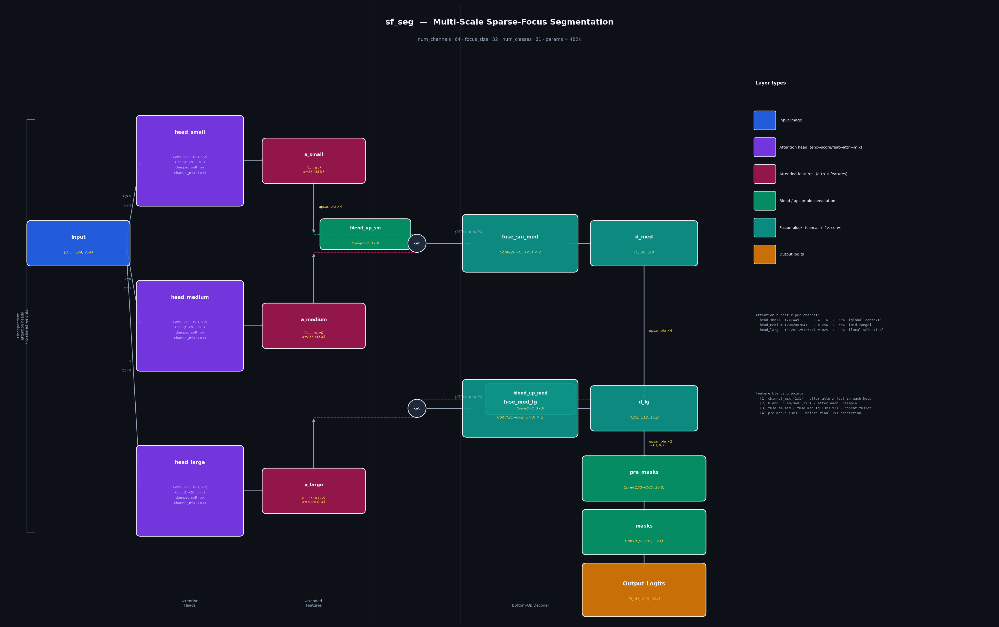

# sf_seg — Multi-scale Sparse-Focus Segmentation

Lightweight semantic segmentation built around **budget-constrained spatial attention via clamped softmax**. Three independent attention heads operate at different image scales; outputs are fused bottom-up in a UNet-style decoder with learned blending at every transition.

Supports any semantic segmentation dataset — ships pre-configured for **ADE20K-150** (recommended) and **COCO-80**.

---

## Architecture



> Generated by `python draw_arch.py` — see [docs/architecture.svg](docs/architecture.svg) for vector version.

### Overview

```
Input x (B, 3, H, W)
  ├─ resize H/16 → head_small  → a_small  (B, C, H/32, W/32)   global context
  ├─ resize H/4  → head_medium → a_medium (B, C, H/8,  W/8 )   mid-range
  └─ full res    → head_large  → a_large  (B, C, H/2,  W/2 )   fine detail

Decoder (bottom-up):
  a_small
    ↓ upsample ×4 → blend_up_sm (3×3 conv)
    cat[↑, a_medium]  → fuse_sm_med (2× 3×3 conv)  →  d_med
    ↓ upsample ×4 → blend_up_med (3×3 conv)
    cat[↑, a_large]   → fuse_med_lg (2× 3×3 conv)  →  d_lg
    ↓ upsample ×2 → pre_masks (3×3 conv)
    → masks (1×1 conv) → logits (B, num_classes, H, W)
```

### Attention Head

Each head receives the image at its assigned scale and runs the full attention pipeline independently:

```
x_scale  (B, 3, H_s, W_s)
  Conv(3→C, 3×3, stride=2) + ReLU          → (B, C,   H_s/2, W_s/2)
  Conv(C→2C, 3×3)                           → (B, 2C,  H_s/2, W_s/2)
  split → score (B, C, L),  features (B, C, L),  L = H_s/2 × W_s/2

  attn     = clamped_softmax(score, k)      → ∈ [0,1], sum=k per channel
  attended = attn × features
  channel_mix: Conv(C→C, 1×1) + ReLU       → cross-channel blend
```

### Clamped Softmax (Budget Attention)

The core constraint: each channel attends to **exactly k pixels**, with each weight in **[0, 1]**.

```
k = min(focus_size², L − 1)         # budget (clamped per-forward for small scales)
L = H' × W'                         # spatial size at attention resolution

p = softmax(score) × k              # sum = k, but values may exceed 1
# Find λ* in O(k log k) via topk:
attn = clamp(p − λ*, 0, 1)          # exactly k total weight, each ≤ 1
```

### Scale / Coverage Table (default: image_size=224, focus_size=32)

| Head         | Input     | Attn space  |   k  |    L  | Coverage |
|:-------------|:---------:|:-----------:|:----:|------:|:--------:|
| `head_small` |  14 × 14  |   7 ×  7    |  16  |    49 |   33 %   |
| `head_medium`|  56 × 56  |  28 × 28    | 256  |   784 |   33 %   |
| `head_large` | 224 × 224 | 112 × 112   | 1024 | 12544 |    8 %   |

Dense coverage at small scales (global context) + sparse at large scale (local selection).

### Blending Strategy

| Location | Layer | Purpose |
|---|---|---|
| After `attn × features` | `channel_mix` (1×1) | Cross-channel mixing after independent attention weighting |
| After each upsample | `blend_up_sm`, `blend_up_med` (3×3) | Adapt bilinearly-stretched features to the new resolution before concat |
| After final upsample | `pre_masks` (3×3) | Blend multi-scale features before 1×1 class prediction |

---

## Loss Functions

### Segmentation loss (`--loss-type`)

**Multi-class** (num_classes > 1):

| Type | Formula |
|---|---|
| `ce` | Cross-entropy with per-class frequency weights |
| `iou` | Soft mean-IoU with `no_obj_weight` for absent classes |
| `ce_iou` *(default)* | `0.5 × CE + 0.5 × soft-IoU` |

**`no_obj_weight`** (default 0.01): weight applied to classes absent from a sample's GT mask. Without it, the model is strongly penalised for predicting any probability for a class that simply isn't in the image — distorting gradients.

**Class frequency weights** (median-frequency balancing, computed from training masks on first run, cached to `data/class_freq.json`):

```
w_c = median_freq / freq_c,   clipped to [0.05, 20]
```

**Binary** (num_classes = 1): `iou`, `bce`, `bce_iou`, `combine`, `mse`.

### Attention Diversity Loss

```
A = normalize(attn.view(B, C, L), dim=-1)    # unit-norm per channel
G = A @ Aᵀ                                    # (B, C, C) cosine-similarity Gram matrix
loss_div = mean(off_diag(G)²) / (C × (C-1))
```

---

## Model Size

With `num_channels=64`, `focus_size=32`:

| num_classes | Params |
|---|---|
| 151 (ADE20K) | ~484 K |
| 81  (COCO-80)| ~482 K |

Adjust `num_channels` to trade capacity for speed: `32`→~100 K · `48`→~220 K · `64`→~480 K · `96`→~1.1 M.

---

## Datasets

### ADE20K-150 (default, recommended)

| | |
|---|---|
| Source | [MIT CSAIL ADE20K Challenge 2016](https://data.csail.mit.edu/places/ADEchallenge/ADEChallengeData2016.zip) (~922 MB) |
| Train / Val | 20,210 / 2,000 images |
| Classes | 150 semantic categories + background → `num_classes=151` |
| Mask format | uint8 PNG, pixel = class index 0–150 (no decoding needed) |
| Density | Fully-dense — every pixel labelled (97% foreground ratio) |
| Avg classes/image | ~10 |
| Why better than COCO | Covers **stuff** (wall, sky, floor, ceiling) + **things** (person, car) → exercises all three attention heads equally |

### COCO-80

| | |
|---|---|
| Source | [COCO 2017](http://images.cocodataset.org/zips/train2017.zip) (~18 GB) |
| Train / Val | ~118,000 / 5,000 images (filtered to annotated only) |
| Classes | 80 object categories + background → `num_classes=81` |
| Mask format | uint8 PNG, pixel = class index 0–80 |
| Density | Sparse — only annotated objects are labelled (~40–60% foreground) |
| Avg classes/image | ~3–5 |

---

## Quick Start

### Install

```bash
pip install -r requirements.txt
```

### Usage patterns

All modules in `src/` can be invoked via `python -m`:

```bash
# Data preparation
python -m src.dataloaders.ade20k --download

# Training
python -m src.training.trainer --epochs 100

# Evaluation & visualization
python -m src.visualization.attention --num-images 8
python -m src.visualization.evaluation --max-images 1000
python -m src.visualization.architecture  # generate diagram

# Benchmarking
python -m src.utils.benchmark

# Or use the bash wrapper
./train.sh --epochs 100
```

Or import directly in Python scripts:
```python
from src.models import sf_seg
from src.training import SegmentationDataset
from src.losses import ce_iou_loss

model = sf_seg(num_classes=151)
```

---

### Train on ADE20K-150

**Step 1 — Prepare data** (run once, ~922 MB download):
```bash
python -m src.dataloaders.ade20k --download
# Options:
#   --image-size 224      resize to 224×224 (default)
#   --workers 8           parallel workers
#   --clean-zip           delete zip after extraction
#   --clean-coco          remove existing data/images + data/masks first
```

**Step 2 — Verify `config.json`:**
```json
{
  "num_classes": 151,
  "loss_type":   "ce_iou",
  "image_size":  224,
  "num_channels": 64,
  "epochs":      200
}
```

**Step 3 — Train:**
```bash
python -m src.training.trainer      # reads config.json
# or
./train.sh
```

---

### Train on COCO-80

**Step 1 — Download + prepare COCO** (requires ~18 GB disk):
```bash
# Legacy scripts in archive/
python archive/download.py --root data --prepare
python archive/rebuild_masks.py
```

**Step 2 — Update `config.json`:**
```json
{
  "num_classes": 81,
  "loss_type":   "ce_iou",
  "image_size":  224,
  "num_channels": 64
}
```

**Step 3 — Train:**
```bash
python -m src.training.trainer
```

---

### Resume training

```bash
python -m src.training.trainer --resume last   # continue from last checkpoint
python -m src.training.trainer --resume checkpoints/sf_seg_best.pt
```

> Resume is skipped automatically if `num_classes` in the checkpoint does not match the current config.

---

## Evaluation & Benchmarking

### Val-set mIoU (runs every epoch automatically)

Training logs per-class IoU to console and `logs/train_log.csv` every epoch:

```
Epoch N | lr=X | train loss=X seg=X div=X acc=X mIoU=X | val loss=X seg=X acc=X mIoU=X
         top10_cls_iou: wall=0.71  floor=0.68  ceiling=0.62  person=0.58 ...
```

---

### Visualise predictions + attention maps

```bash
# Saves RGB | GT | PRED panels to outputs/attention_vis/
python -m src.visualization.attention \
    --checkpoint checkpoints/sf_seg_best.pt \
    --data-root  data \
    --num-images 8 \
    --head       large        # large | medium | small
    --show-channels 8         # individual channels to display
    --min-range  0.05         # only channels with spatial variation ≥ 0.05
    --output-dir outputs/attention_vis

# Each output shows 6 fixed panels:
#   [Input RGB] [GT mask] [Predicted mask]
#   [Attn small (global)] [Attn medium] [Attn large (local)]
#   + up to N individual channel maps from --head
```

---

### Cross-dataset evaluation (LVIS)

Evaluate a model trained on ADE20K / COCO on LVIS v1 val images
(uses locally-available images — no extra download if COCO train2017 is present):

```bash
# Download LVIS val annotations first (~64 MB)
python -c "
import requests, zipfile, pathlib
url  = 'https://dl.fbaipublicfiles.com/LVIS/lvis_v1_val.json.zip'
dest = pathlib.Path('data/lvis/lvis_v1_val.json.zip')
dest.parent.mkdir(parents=True, exist_ok=True)
dest.write_bytes(requests.get(url).content)
with zipfile.ZipFile(dest) as z: z.extractall('data/lvis')
print('Done')
"

# Run evaluation
python -m src.visualization.evaluation \
    --checkpoint  checkpoints/sf_seg_best.pt \
    --lvis-ann    data/lvis/lvis_v1_val.json \
    --data-root   data \
    --max-images  1000          # 0 = all available
    --vis-samples 8             # save N visualisation images
    --output-dir  outputs/lvis_eval
```

Output:
```
── Category Coverage ───
LVIS total categories  : 1,203
COCO-80 overlap        : 59 (4.9%)     ← model's known classes
LVIS-only (model blind): 1,144

── Results ─────────────
mIoU (overlap classes) : X.XX%
Background IoU         : X.XX%

── Per-Class IoU ────────
person   0.58    car   0.51    chair  0.44 ...
```

> Key finding: a COCO-trained model scores ~0% mIoU on LVIS because 95% of LVIS categories are unknown. An ADE20K-trained model similarly cannot detect LVIS-only objects. Use `evaluate_lvis.py` to measure transfer overlap.

---

### Latency benchmark

```bash
python -m src.utils.benchmark        # requires CUDA
# Reports per-operation latency of clamped_softmax + full forward/backward
```

---

## Hyperparameters

All arguments can also be set in `config.json` (CLI overrides config):

| Argument | Default | Description |
|---|---|---|
| `--num-channels` | 64 | Feature channels C per attention head |
| `--focus-size` | 32 | Budget k = focus_size² for large head; auto-scaled for smaller heads |
| `--encoder-stride` | 2 | Stride inside each head's first conv |
| `--num-classes` | 151 | Total classes incl. background — **151 for ADE20K, 81 for COCO** |
| `--loss-type` | `ce_iou` | `ce` / `iou` / `ce_iou` (multi-class); `bce` / `combine` (binary) |
| `--no-obj-weight` | 0.01 | IoU loss weight for classes absent from a sample (0=ignore) |
| `--diversity-weight` | 0.1 | Attention diversity / Gram penalty |
| `--image-size` | 224 | Square input resolution |
| `--lr` | 1e-4 | Adam learning rate (cosine decay → lr × 0.01) |
| `--batch-size` | 32 | Batch size |
| `--epochs` | 200 | Training epochs |
| `--resume` | — | `last` / `auto` / path to `.pt` checkpoint |
| `--data-root` | `data` | Dataset root directory |

---

## Training Pipeline

| Component | Choice | Reason |
|---|---|---|
| Optimizer | Adam | Adaptive LR, fast convergence |
| LR schedule | CosineAnnealingLR (→ lr × 0.01) | Smooth decay, avoids plateau |
| Augmentation | Flip, rotate ±15°, translate 10%, colour jitter | Regularisation |
| Mixed precision | AMP (autocast + GradScaler) | ~2× speed, ~½ VRAM on CUDA |
| DataLoader | pin_memory, non_blocking, prefetch=2 | CPU→GPU transfer overlap |
| Confusion matrix | GPU bincount per batch, single `.cpu()` at epoch end | Efficient mIoU, no per-batch sync |
| Checkpointing | `sf_seg_best.pt` + `sf_seg_last.pt` | Safe resume with optimizer + scheduler state |

---

## File Structure

```
sf_seg/
├── src/                         # Main source code (modular structure)
│   ├── __init__.py
│   ├── models/
│   │   ├── __init__.py
│   │   └── sf_seg.py           # Model: attention_head, sf_seg (multi-scale pyramid)
│   ├── losses/
│   │   ├── __init__.py
│   │   └── losses.py           # CE+IoU, soft-IoU (no_obj_weight), diversity loss
│   ├── dataloaders/
│   │   ├── __init__.py
│   │   ├── ade20k.py           # Download + prepare ADE20K-150 dataset
│   │   └── utils.py            # General resize / filter for processed images
│   ├── training/
│   │   ├── __init__.py
│   │   └── trainer.py          # Training: AMP, mIoU, class-freq weights, logging
│   ├── visualization/
│   │   ├── __init__.py
│   │   ├── architecture.py     # Generate architecture diagram → docs/*.png
│   │   ├── attention.py        # Multi-scale attention map visualisation
│   │   └── evaluation.py       # Cross-dataset evaluation on LVIS v1 val
│   └── utils/
│       ├── __init__.py
│       └── benchmark.py        # Per-op latency benchmark (CUDA)
│
├── config.json                 # Default hyperparameters
├── requirements.txt            # Python dependencies
├── train.sh                    # Bash wrapper: ./train.sh [extra args]
├── README.md                   # This file
│
├── docs/
│   ├── architecture.png        # Architecture diagram (generated by src.visualization.architecture)
│   └── architecture.svg
│
└── archive/                    # Legacy COCO-specific scripts (reference only)
    ├── download.py             # Download COCO 2017 + build binary/multi-class masks
    └── rebuild_masks.py        # Rebuild COCO masks with all 80 class indices
```

All Python modules live in `src/`. Run via `python -m src.<module>` or import directly in custom scripts.
