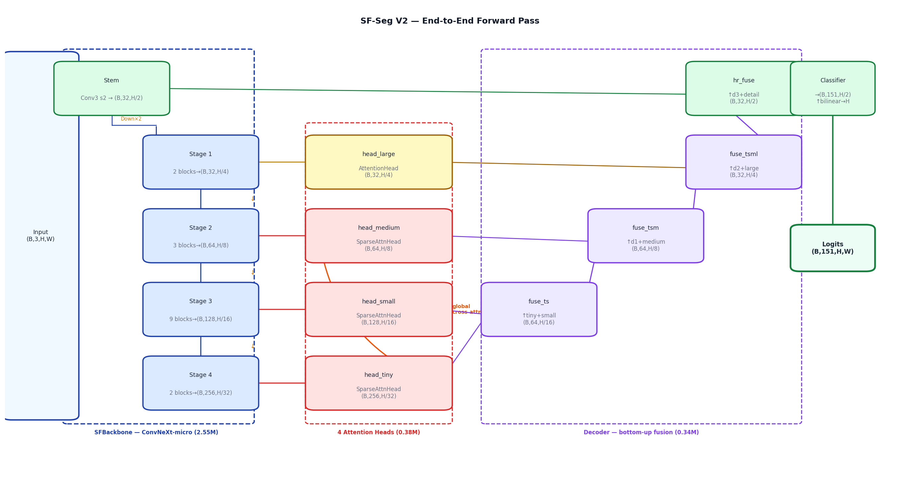
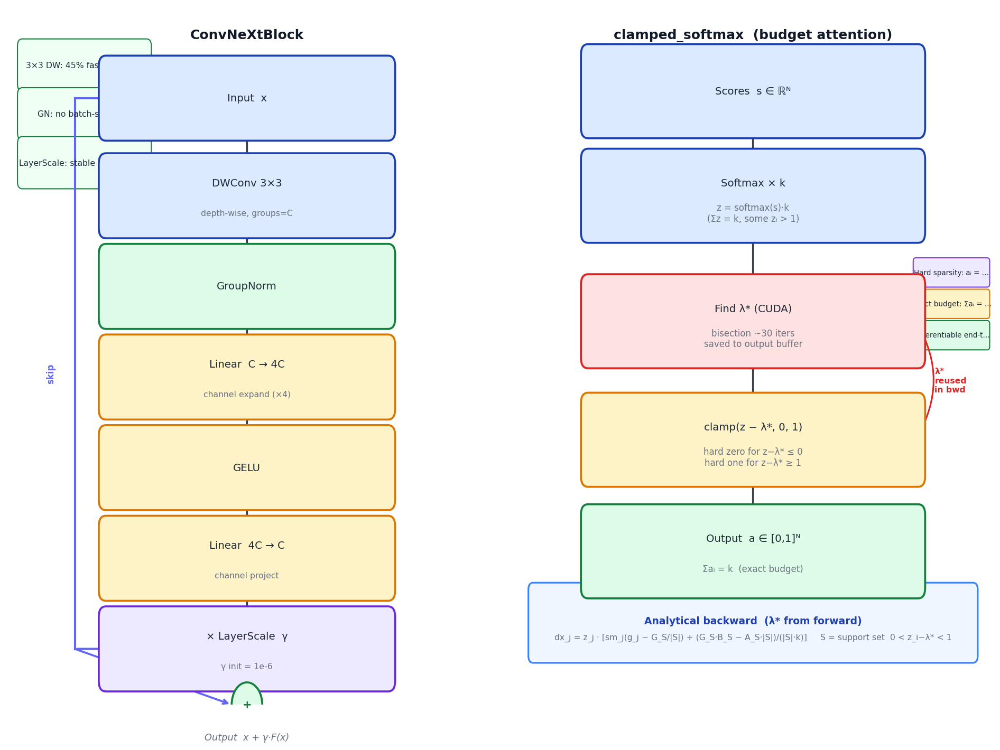
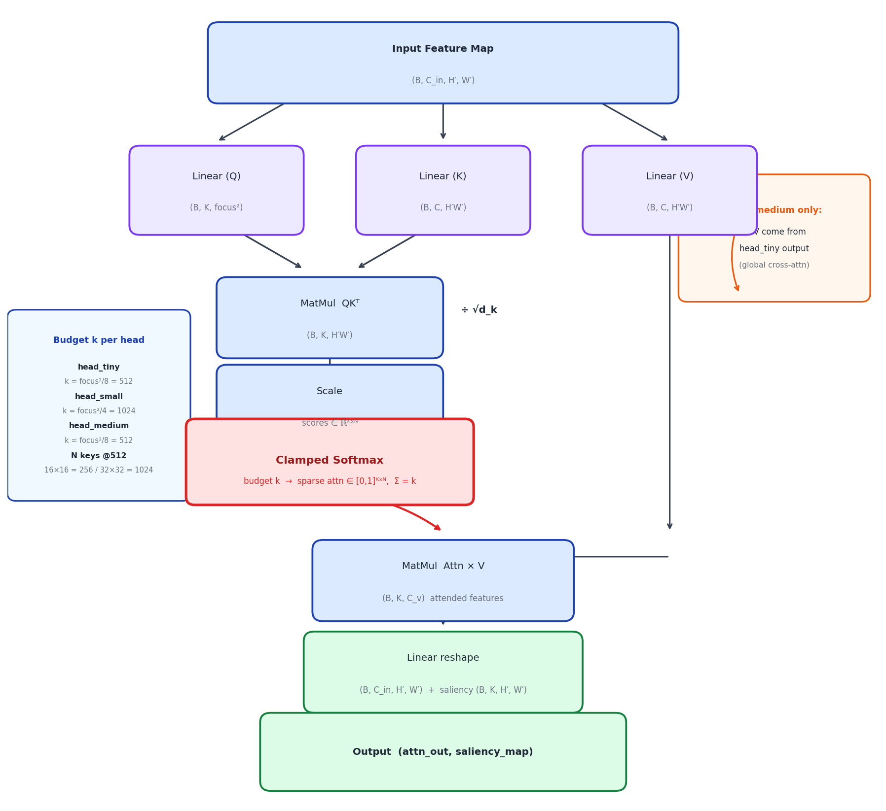
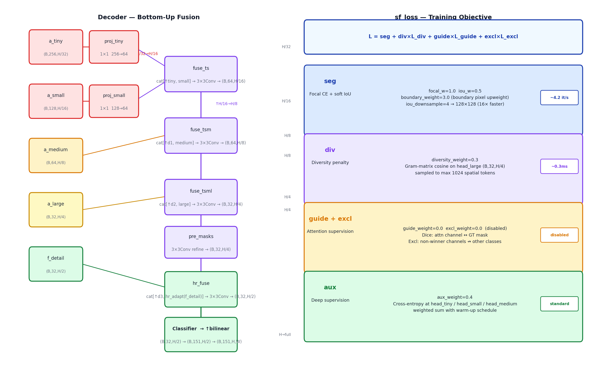

# SF-Seg V2 — Sparse-Focus Semantic Segmentation

Semantic segmentation with **budget-constrained sparse attention** (`clamped_softmax`).  
Custom ConvNeXt-style backbone trained from scratch. Dataset: ADE20K-150 (151 classes).

---

## Architecture diagrams

**End-to-end forward pass** (backbone → heads → decoder → logits):



**Building blocks** — ConvNeXtBlock and clamped_softmax:



**SparseAttnHead** — Q/K/V budget attention:



**Decoder fusion and training loss**:



---

## Model overview

```
Input (B, 3, H, W)
       │
       ▼  SFBackbone (ConvNeXt-micro, 2.55M)
       ├─ stem        → (B,  32, H/2,  W/2)   f_detail ─────────────────────────┐
       ├─ stage1      → (B,  32, H/4,  W/4)   f1 ──→ head_large  (AttentionHead)  │
       ├─ stage2      → (B,  64, H/8,  W/8)   f2 ──→ head_medium (SparseAttnHead) │
       ├─ stage3      → (B, 128, H/16, W/16)  f3 ──→ head_small  (SparseAttnHead) │
       └─ stage4      → (B, 256, H/32, W/32)  f4 ──→ head_tiny   (SparseAttnHead) │
                                                              │                    │
                                               cross-attn ◄──┘ (head_medium)      │
                                                                                   │
                              Decoder: bottom-up fusion (fuse_ts → fuse_tsm → fuse_tsml)
                                                              │                    │
                                              hr_fuse at H/2 ◄────────────────────┘
                                                              │
                                              Classifier → bilinear ↑
                                                              │
                                         Logits (B, 151, H, W)
```

### Attention heads

| Head | Scale | Mechanism | num_heads | Role |
|---|:---:|---|:---:|---|
| `head_tiny`   | H/32 | SparseAttnHead (self) | 8 | Global semantic context |
| `head_small`  | H/16 | SparseAttnHead (self) | 4 | Mid-scale features |
| `head_medium` | H/8  | SparseAttnHead (cross ← head_tiny) | 4 | Global context, cheap |
| `head_large`  | H/4  | AttentionHead (spatial gating) | — | Sharp boundary detail |

**Sparsity curriculum**: at 512px, `head_tiny` attends to 64/256 ≈ 25% of tokens.
At 256px (early training), budget covers 100% → naturally dense → sparse as resolution grows.

### Clamped Softmax — budget attention

```
Input : score ∈ ℝᴺ  (N = sequence length)
        k            (budget: total attention mass = k)
Output: attn ∈ [0,1]ᴺ  with Σ attnᵢ = k exactly

Step 1:  p = softmax(score) × k          (Σp = k, some pᵢ > 1)
Step 2:  find λ* s.t. Σ clamp(p−λ*, 0,1) = k   (bisection, ~30 iters, CUDA kernel)
Step 3:  attn = clamp(p − λ*, 0, 1)
Bwd:     analytical gradient (λ* saved from CUDA forward) — 27ms vs 62ms topk
```

Properties: hard zeros (sparse), bounded per-token weight, exactly k total mass, differentiable.

---

## Model size (V2-micro, num_channels=32)

| Component | Params |
|---|---:|
| SFBackbone (ConvNeXt-micro) | 2,553,120 |
| head_tiny (8 heads) | 262,656 |
| head_small (4 heads) | 65,792 |
| head_medium (4 heads) | 49,280 |
| head_large | 3,488 |
| Decoder + classifier | 339,324 |
| **Total** | **3,273,660 (3.27M)** |

Comparable to SegFormer-B0 (3.7M). No pretrained weights.

---

## Quick start

### Setup

```bash
python -m venv venv && source venv/bin/activate
pip install -r requirements.txt
```

### Build CUDA op (clamped_softmax)

```bash
python -c "from src.ops import clamped_softmax; print('CUDA op ready')"
```

### Prepare ADE20K data

```bash
python -m src.dataloaders.ade20k --download
```

### Train

```bash
./train.sh
# Resume:
./train.sh --resume last
```

---

## Config (`config.json`)

Current optimal settings for RTX 3090 / 512×512 / ADE20K-150:

```json
{
  "model_type":        "v2",
  "backbone_variant":  "micro",
  "num_channels":      32,
  "dw_kernel":         3,
  "focus_size":        64,
  "num_classes":       151,
  "image_size":        512,
  "batch_size":        16,
  "epochs":            200,
  "num_workers":       4,

  "lr":                2e-4,
  "backbone_lr_factor":0.1,
  "grad_clip":         5.0,

  "iou_w":             0.5,
  "iou_downsample":    4,
  "iou_warm_epochs":   10,
  "boundary_weight":   3.0,
  "diversity_weight":  0.3,
  "aux_weight":        0.4,
  "edge_weight":       0.0,

  "aug_hflip": true, "aug_resized_crop": true,
  "aug_color_jitter": true, "aug_hue": false,
  "aug_cutout": true, "aug_shift": true
}
```

| Key | Description |
|---|---|
| `num_channels` | Base width C → pyramid C / 2C / 4C / 8C = 32/64/128/256 |
| `focus_size` | Attention budget k = focus_size². 64 → max 4096 tokens attended |
| `dw_kernel` | DWConv kernel in ConvNeXtBlock. 3 is 45% faster than 7, same quality |
| `iou_downsample` | Downsample factor for soft-IoU computation (4 = H/4, 16× faster) |
| `boundary_weight` | Upweight class-boundary pixels in focal CE (morphological dilation) |
| `diversity_weight` | Gram-matrix penalty to diversify attention channels |
| `iou_warm_epochs` | Delay soft-IoU for this many epochs (CE warms up first) |
| `aug_hue` | **Keep false** — PIL hue is 7.4ms/image and bottlenecks DataLoader |

---

## Loss

```
L = seg  +  diversity_w × L_div  +  (guide_w × L_guide + excl_w × L_excl)
```

- **seg** = `focal_w × focal_CE` + `iou_w × soft_IoU`
  - Focal CE with class-boundary upweighting (`boundary_weight=3.0`)
  - Soft IoU computed at H/4 resolution (`iou_downsample=4`) — 16× cheaper
- **diversity** — Gram-matrix cosine penalty on `head_large` maps
- **guide / excl** — disabled by default (`=0.0`), enable once training is stable
- **aux** — deep supervision at head_tiny / head_small / head_medium scales

---

## Training performance (RTX 3090, batch=16, 512×512)

| Config | Speed |
|---|:---:|
| CE only (no IoU, no edge) | 5.67 it/s |
| CE + soft IoU full-res (iou_downsample=1) | 3.93 it/s |
| **CE + soft IoU ds=4 (current)** | **~4.2 it/s** |
| + Sobel edge (disabled) | 3.14 it/s |

DataLoader throughput: 172 samples/s with `aug_hue=false`, 95 samples/s with hue — GPU is bottleneck, not DataLoader.

---

## File structure

```
sf_seg/
├── src/
│   ├── models/
│   │   ├── sf_seg_v2.py          # V2: SFBackbone + heads + decoder (default)
│   │   └── sf_seg_r18.py         # V1: ResNet-18 backbone (legacy)
│   ├── losses/
│   │   └── sf_loss.py            # focal CE + soft IoU + diversity + boundary
│   ├── ops/
│   │   ├── clamped_softmax_cuda.cu   # CUDA bisection kernel + λ* output
│   │   └── __init__.py               # analytical backward (saves 35ms/iter)
│   ├── dataloaders/
│   │   └── ade20k.py             # ADE20K dataset
│   └── training/
│       ├── trainer.py            # Training loop
│       └── visualize.py          # Epoch output visualisation
├── docs/
│   ├── arch_01_overview.png      # Full architecture overview
│   ├── arch_02_backbone.png      # SFBackbone detail
│   ├── arch_03_blocks.png        # ConvNeXtBlock + SparseAttnHead
│   ├── arch_04_decoder.png       # Decoder fusion
│   └── arch_05_loss_probe.png    # Loss components + probing stats
├── scripts/
│   └── attention.py              # Visualise attention maps
├── config.json
├── requirements.txt
└── train.sh
```
