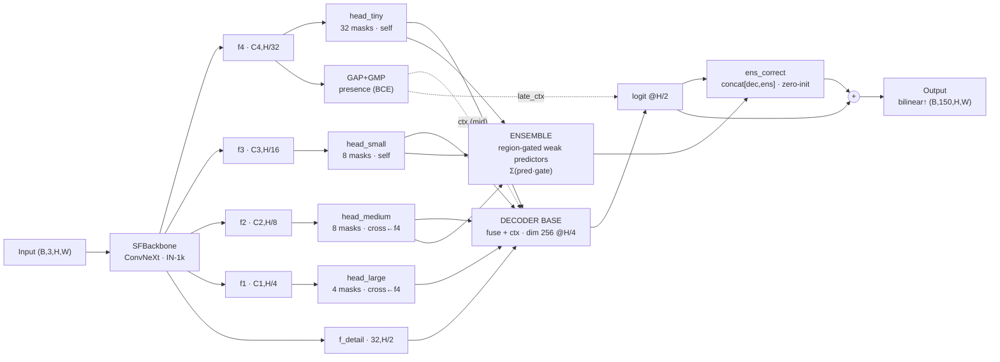
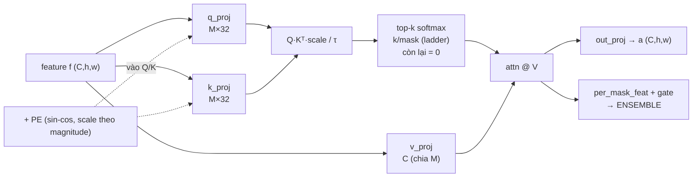
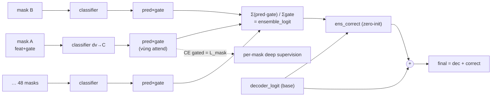

# SF-Seg V2 — Cách hoạt động chi tiết của model

Tài liệu này mô tả kiến trúc hiện tại (`sf_seg_v2`) đúng theo code, kèm lý do thiết
kế và các phát hiện thực nghiệm. Dataset: ADE20K, 150-class protocol (label 0
"unlabeled" → ignore 255, class 1..150 → 0..149).

Input: `(B, 3, H, W)` ảnh RGB. Output: `(B, 150, H, W)` logits per-pixel.

---

## 0. Tổng quan luồng dữ liệu

**Sơ đồ forward end-to-end** (input → backbone → 4 sparse heads → decoder base + ensemble → final):



Phiên bản text để scan nhanh:

```
ảnh (B,3,H,W)
   │
   ▼ SFBackbone (ConvNeXt-style, IN-1k pretrained)
   ├─ f_detail (32, H/2)   ── nhánh detail (biên sắc)
   ├─ f1 (C1, H/4)         → head_large   (sparse cross-attn ← f4, 4 masks)
   ├─ f2 (C2, H/8)         → head_medium  (sparse cross-attn ← f4)
   ├─ f3 (C3, H/16)        → head_small   (sparse self-attn)
   └─ f4 (C4, H/32)        → head_tiny    (sparse self-attn) + GAP/GMP → presence
   │
   ├──► [A] DECODER BASE: fuse bottom-up (tiny→small→medium→large) → logits @H/2
   │        + presence mid-fusion (ctx) + late-fusion (logit prior)
   │
   └──► [B] ENSEMBLE BRANCH (nếu enable_ensemble):
            mỗi sparse mask = weak predictor (classifier gated bởi vùng attend)
            → Σ(pred·gate) = ensemble_logit
   │
   ▼ final = decoder_logit + ens_correct([decoder_logit, ensemble_logit])
   ▼ bilinear upsample → (B, 150, H, W)
```

Với `num_channels=32`: `C1,C2,C3,C4 = 32, 64, 128, 256`. Training tính loss tại
**H/2** (target nearest-downsample) để nhanh 1.5×; eval dùng full-res.

---

## 1. Backbone — SFBackbone (định nghĩa trong `sf_seg_v2.py`)

ConvNeXt-style tự thiết kế, **không** ResNet. 4 stage, mỗi stage gồm `ConvNeXtBlock`:

```
x → DWConv(k×k, groups=C) → GroupNorm → PWConv(C→4C) → GELU → PWConv(4C→C) → ×γ(LayerScale) → + x
```

- **DWConv kernel = 3** (config `dw_kernel`), nhanh hơn 7×7 ~45%, chất lượng tương đương.
- **GroupNorm** (không BatchNorm) → ổn với batch nhỏ, không khóa resolution.
- **LayerScale γ init 1e-6** → mỗi block khởi đầu ≈ identity → train from scratch ổn định.
- **Stem stride 2** (không 4) để xuất `f_detail` ở H/2 cho nhánh biên.

Variant `micro` (đang dùng): depths `[2,3,9,2]`, `num_channels=32` → backbone ~2.55M.
Variant `small`: `[3,4,12,3]`, C=64 → ~14M (dành cho scale-up).
Config hiện tại: micro C=32, `attn_masks=[32,8,8]`, `image_size=224` (thử nghiệm
SAED nhanh), `enable_ensemble=true`.

**Backbone được pretrain ImageNet** (`pretrain_imagenet.py`, top-1 67.3%) — đây là
đòn quan trọng nhất phá trần data 20K ảnh ADE. Phân bố params chuẩn ConvNeXt:
stage3+stage4 ≈ 72% (capacity dồn về tầng sâu, semantic).

---

## 2. Sparse Attention Heads — `SparseAttnHead` (động cơ của model)

**Cả 4 head đều sparse** (`head_tiny/small/medium/large`, đều `SparseAttnHead`).
**Ablation chứng minh**: bỏ attention selectivity → mIoU sập 0.24→0.07 (sparse
attention đóng **+0.16 mIoU, ~69% performance**) — đây là động cơ của model.



> diversity loss phạt masks giống nhau → mỗi mask attend vùng khác.

### 2.1 Cơ chế: sparse attention (top-k softmax)

Attention thường: `softmax(Q·Kᵀ/√d)` → mọi key nhận mass. Ở đây dùng **top-k softmax**
(`attn_op='topk'`): mỗi query giữ **top-k score**, softmax trên chúng (Σ=1), phần
còn lại **= 0 cứng** → mỗi query focus **đúng k điểm quan trọng nhất**.

```
giữ top-k(score) mỗi query → softmax trên k điểm đó (Σ=1) → còn lại = 0
```

`k` theo budget ladder per-mask. Verify: head_tiny k=12 → active = 12/49 đúng (sparse thật).

> **Lịch sử & bài học:** trước đây dùng `clamped_softmax` (budget k, `attn_op='clamp'`,
> CUDA kernel ở `src/ops/`) — nhưng đo được nó **KHÔNG sparse**: budget k là *SÀN* số
> token active (cap 1/token, Σ=k → cần ≥k token), và attention peaked bị **spread**
> (λ<0 cộng đều) → 100% token active. Đã thay bằng top-k (sparse thật). `attn_op`
> giữ cả hai để A/B. Nếu top-k "kẹt" (token bị zero không nhận gradient), cân nhắc
> sparsemax/entmax (sparse + gradient đầy đủ).

### 2.2 Temperature τ (sharpening, learnable)

`sim = (Q·Kᵀ)·scale / τ`, với `τ = exp(log_temp)` là `nn.Parameter` học được
(config `attn_temperature` init). τ<1 → score peaked hơn. (Lưu ý: với budget lớn
hiện tại, τ sharpen soft attention nhưng chưa tạo hard-zero.)

### 2.3 Decoupled qk_dim

Vấn đề: nhiều mask → `C/num_heads` (value dim) co lại → similarity dim quá hẹp.
Giải: **Q,K chiếu riêng ra `num_heads × 32`** (qk_dim=32 cố định), V vẫn chia C.
→ tăng số mask không làm similarity yếu đi, chỉ value dim mỏng đi.

### 2.4 Budget ladder

Các mask trong cùng head mang **budget khác nhau** (log-spaced từ `k_max` xuống
floor `N_k//32`): mask budget lớn = stuff-detector (sky/wall), mask budget nhỏ =
object nhỏ. Floor tỉ lệ N_k (không cố định 4) để mask budget nhỏ không collapse.

### 2.5 Positional encoding (PE) + temperature τ

sin-cos 2D **tuyệt đối** chuẩn hóa [0,1], cộng vào nhánh **Q/K** (V giữ sạch). Lý do
absolute: cặp confusion ceiling↔wall↔floor định nghĩa bằng vị trí.

> **Fix quan trọng (`_apply_pe`):** PE std cố định 0.57, nhưng feature các scale lệch
> nhau cực mạnh (f4 std 1.67 vs f2 std 0.06). Cộng PE thẳng → ở medium PE **lấn át
> content 8×** → attention thành sin/cos thuần vị trí (vô nghĩa). Fix: scale PE theo
> magnitude feature × `pe_scale` (learnable, init 0.3) → `PE_std = pe_scale × feat_std`
> mọi scale → PE luôn là tỉ lệ cố định, không nuốt content (medium ratio 8.28→0.12).

**Temperature τ** (`log_temp`, learnable, config `attn_temperature`): `sim = Q·Kᵀ·scale/τ`
→ τ<1 làm score sắc hơn (ảnh hưởng độ tập trung của top-k).

### 2.6 Anti-collapse diversity loss

Trong forward (grad-enabled): phạt cosine similarity giữa received-attention của
các mask → buộc chúng khác nhau. Lưu ý: ngăn collapse *giống hệt* nhưng có thể đẻ
"pattern khác nhau bằng nhiễu" nếu feature scale đó không đủ giàu (small/medium).

### 2.7 Cross-attention heads (medium + large)

- **head_medium**: Q từ f2 (H/8), K,V từ f4 (global, H/32) → query local nhìn token global.
- **head_large**: Q từ f1 (H/4, high-res), K,V từ f4 (global), 4 masks. *Trước* là
  spatial-gating dense (clamp k≥N → "đỏ hết", ablation +0.0006 vô dụng); đã **convert
  sang SparseAttnHead cross-attn** → sparse + global context ở độ phân giải cao nhất.

Cross-attn rẻ (ít key f4) mà mang context toàn cục.

---

## 3. Ensemble Branch — SAED (region-gated weak predictors)

Bật qua `enable_ensemble`. Hiện thực hóa ý tưởng: **mỗi sparse mask là một weak
predictor; budget giới hạn nên nó chỉ predict tốt ở vùng nó attend; gộp lại +
sửa sai.** Đánh vào **đuôi dài** (class hiếm được nhiều mask "nhìn").



> Class hiếm: nhiều mask attend cùng vùng → vote nhiều lần + decoder base +
> correction → "tư duy ≥2 lần".

### 3.1 Per-mask weak predictor (`_build_ensemble`)

Head trả thêm (khi `return_per_mask=True`):
- `per_mask_feat` (B, M, dv, h, w): feature value-weighted của từng mask.
- `per_mask_gate` (B, M, h, w): `max attention per query` = độ tự tin của mask ở mỗi vị trí.

Mỗi scale có classifier chia sẻ `dv → hidden → C` (`ens_clf_tiny/small/medium`):
```
pred_i = classifier(feat_i)            # (B, M, C, h, w) — mask i predict đủ C class
gate_i = gate_i / max(gate_i)          # norm [0,1] mỗi mask
```

### 3.2 Ensemble combine

```
ensemble_logit = Σ_i (pred_i × gate_i) / (Σ_i gate_i + ε)
```
Weighted average theo vùng attend — "gộp các vùng đúng". Mỗi pixel nhận đóng góp
từ các mask attend nó. Class hiếm ở vùng nào → các mask attend vùng đó cùng vote.

### 3.3 Correction head ("sửa vùng sai")

```
final = decoder_logit + ens_correct( concat[decoder_logit, ensemble_logit] )
```
`ens_correct` = Conv3×3 → GN → GELU → Conv1×1, **zero-init lớp cuối** → lúc đầu
`final ≈ decoder_logit` (warm-start không xáo trộn), ensemble "mọc" dần.

### 3.4 Per-mask supervision (deep supervision)

Trong `trainer.py`: mỗi mask chịu **region-gated CE** — supervise CHỈ ở vùng nó
attend:
```
L_mask = Σ_i [ CE(pred_i, label) × gate_i ].sum() / gate_i.sum()
```
→ mask attend vùng nào thì học predict đúng class vùng đó. Diversity ép các mask
attend vùng khác nhau → mỗi mask thành expert một vùng/class. Weight `mask_sup_weight`.

---

## 4. Decoder base (fuse bottom-up)

Chạy song song ensemble, là "đường mạnh" sẵn có:
```
proj_tiny(a_tiny) ↑ + proj_small(a_small) → fuse_ts  (H/16)
   ↑ + a_medium                            → fuse_tsm (H/8)
   ↑ + a_large                             → fuse_tsml(H/4, decoder_dim=256)
   → pre_masks (ConvNeXt refine) → proj_hr (256→96)
   → upsample H/2 + hr_adapt(f_detail) → hr_fuse → masks (96→256→150) → logits
```
`decoder_dim=256` rộng để phân biệt 150 class (bottleneck 32-d cũ gây confusion).
Nhánh `f_detail` ở H/2 lo biên sắc.

---

## 5. Presence-guided global context

`g = GAP(f4) + GMP(f4)` — tóm tắt toàn ảnh (sum của mean-pool + max-pool; max-pool
cứu object nhỏ mà mean-pool rửa trôi). Ba cơ chế:

1. **Presence head**: `g → Linear → 150` logits, supervise bằng **BCE multi-label**
   "class nào có trong ảnh" (label free từ mask, pos_weight=4). Ép g mang thông
   tin tổng quan. Đo qua metric `presF1`.
2. **Mid-fusion** (`ctx_proj`, zero-init): `g → Linear → cộng vào decoder @H/4` →
   mỗi pixel thấy scene context.
3. **Late-fusion** (`late_ctx`, zero-init, 150×150): `logits += late_ctx(presence)`
   — prior per-class toàn ảnh (phân rã Bayes log P(c|pixel) + log P(c|ảnh)).

---

## 6. Losses (training)

```
L = L_seg(final, label)                         # focal CE (sqrt-freq) + soft IoU
  + aux_weight · L_aux                           # deep supervision 3 scale (CE)
  + presence_weight · L_presence                 # BCE multi-label
  + attn_div_weight · L_div                       # anti-collapse diversity
  + mask_sup_weight · L_mask                       # region-gated per-mask CE (ensemble)
```

- **focal CE sqrt-frequency**: mean trong từng class rồi weighted-mean với √n_c →
  per-pixel weight ∝ 1/√n_c. Cân giữa pixel-mean (class lớn nuốt gradient) và pure
  class-mean (over-correct).
- **soft IoU** (`sf_loss._seg_term`): per-class `1−IoU` (hoặc `−ln IoU` nếu
  `iou_form=log`), chuẩn hóa theo **số class tồn tại** (không phải tổng weight —
  tránh class vắng pha loãng), weight obj=1 / no-obj=0.1. Knob: `focal_w`, `iou_w`,
  `iou_downsample`, `iou_form`. Ramp sau `iou_warm_epochs` (chỉ khi focal_w>0).

---

## 7. Training protocol

- **AllClassBatchSampler**: mỗi optimizer step (batch×accum ảnh) chứa **đủ 150
  class** (greedy set cover + rotation class hiếm + usage tie-break) → mọi mask
  thấy mọi class, kể cả hiếm nhất (41 ảnh).
- **Copy-paste augmentation**: dán region class hiếm (<300 ảnh) từ ảnh nguồn vào
  ảnh đích → tăng pixel class hiếm ~3-4× → đánh đuôi dài.
- **Augment khác**: hflip, shift, resized-crop, cutout (mask-aware → vùng cut =
  ignore 255), color-jitter. Dropout2d trước classifier.
- **Two-stage resolution**: train chính @384 (hoặc 224 thử nghiệm) → tuning @512.
- **lr constant** (warmup 5 epoch) — decay từng làm đóng băng backbone khi kết
  hợp backbone_lr_factor; với full backbone lr thì constant ổn.

---

## 8. Các phát hiện thực nghiệm cốt lõi (đã đo trong dev)

| Phát hiện | Số liệu | Hệ quả |
|---|---|---|
| Sparse attention là engine | bỏ selectivity → mIoU 0.24→0.07 | kiến trúc attention đúng, giữ |
| head_tiny quan trọng nhất | tắt → −0.055 | feature sâu (f4) gánh semantic |
| clamp KHÔNG sparse | 100% token active, peaked→spread | **đã thay bằng top-k** (active=k đúng) |
| PE lấn át content medium | ratio 8.28 (f2 std 0.06) | **đã fix** `_apply_pe` scale theo magnitude |
| head_large spatial-gating thừa | tắt → +0.0006 | **đã convert** sang sparse cross-attn |
| Trần là đuôi dài | top-30 mIoU ~0.30, 100+ class ~0.05 | SAED + copy-paste nhắm chỗ này |
| Data-limited | train 0.50 vs val 0.29, gap 0.30 | IN-1k pretrain + augment là đòn chính |

*(Các findings cũ — clamp soft, head_large thừa, PE sin/cos — đã được sửa bằng top-k,
convert sparse cross-attn, và `_apply_pe`. Bảng ghi cả vấn đề lẫn fix để truy vết.)*

**mIoU tốt nhất hiện tại**: ~0.286 @384px (`backups/sf_seg_384_miou2856.pt`).
Mục tiêu cạnh tranh SegFormer-B0 (~0.374) cần: 512 tuning + phá trần data
(COCO-Stuff / backbone lớn) + SAED ensemble cho đuôi dài.

---

## 9. Bản đồ file

- `src/models/sf_seg_v2.py` — model: `sf_seg_v2`, `SFBackbone`, `ConvNeXtBlock`,
  `_build_ensemble`, presence/ensemble heads.
- `src/models/sf_seg_r18.py` — `SparseAttnHead` (top-k/clamp attn, temperature, qk
  decoupled, ladder, PE `_apply_pe`, per-mask output), `_topk_softmax`, `_sincos_pe_2d`.
  (`AttentionHead` còn nhưng không dùng — head_large đã chuyển sparse.)
- `src/ops/` — `clamped_softmax` (CUDA kernel) — nay là tùy chọn `attn_op='clamp'`.
- `src/losses/sf_loss.py` — `sf_loss`, `_seg_term` (focal CE + soft IoU).
- `src/training/trainer.py` — train loop, `ADE20KDataset` (+copy-paste),
  `AllClassBatchSampler`, per-mask/presence/aux losses, config merge.
- `config.json` — mọi knob. `scripts/probe_ckpt.py`, `analyze_errors.py` — đánh giá.
